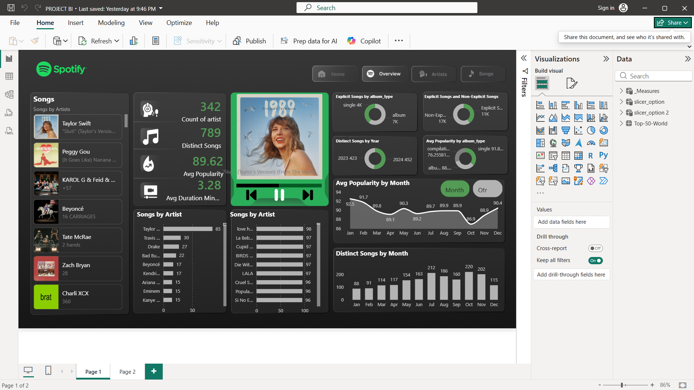

# 🎧 Spotify Songs Analysis Dashboard (Power BI)

## 📌 Overview
This project presents an interactive Power BI dashboard analyzing Spotify songs and artists to uncover trends in music data. The goal is to transform raw data into meaningful insights through visualization and analytics.

## 🛠️ Tools & Technologies
- Power BI  
- DAX (Data Analysis Expressions)  
- Power Query  
- Data Modeling  

## 📊 Key Features
- KPI metrics including total songs, total artists, average popularity, and song duration  
- Monthly trend analysis of song popularity  
- Comparison of explicit vs non-explicit songs  
- Identification of top-performing artists and songs  
- Interactive filters and slicers for dynamic data exploration  

## 🔍 Key Insights
- Identified patterns in song popularity over time  
- Highlighted top artists contributing to high engagement  
- Analyzed distribution of explicit content in music data  
- Provided insights useful for content and audience strategy  

## 📁 Files Included
- Power BI Dashboard file (.pbix)  
- Dashboard screenshots  

## 🚀 Conclusion
This project demonstrates the use of Power BI for data transformation, modeling, and visualization. It highlights the ability to create interactive dashboards and generate actionable insights from real-world datasets.
